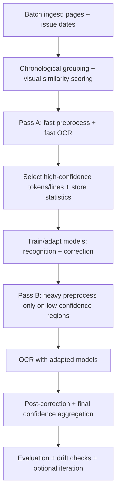
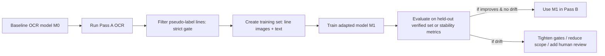

# Batch-adaptive OCR Preparation for Historical Newspaper Microfilm

## Executive summary

Batch OCR projects (multiple issues of the same newspaper over time) create a valuable opportunity: **pages with higher legibility can be used to adapt models and parameters that then improve hard pages**, as long as the adaptation is constrained by reliable confidence and drift controls. This is consistent with (a) historical OCR workflows that emphasize **continuous model training** and reuse of corrected material as training data, as in OCR4all, and (b) OCR engines that explicitly require **typographically similar** training data (i.e., same or similar fonts/print characteristics), as emphasized in Kraken’s training guidance. citeturn7view0turn5view0

A practical, implementable plan is a **two-pass, chronologically-aware self-training pipeline**:

- **Pass A (fast sweep):** run a lightweight preprocessing + OCR pass over all issues to extract **high-confidence lines/words**, estimate type/press “style signatures,” and store per-issue/per-window calibration parameters (illumination model ranges, stroke width distributions, layout templates, OCR confusion statistics). This is “data capture,” not perfect OCR. citeturn5view0turn4view0  
- **Pass B (targeted refinement):** revisit **only the low-confidence regions** using the heavier research-backed preprocessing you outlined (confidence maps, regularization, bleed-through suppression, gated deblurring) but now informed by the stored batch statistics and adapted models. citeturn8view0turn10view0

The learning pathway is best framed as **semi-supervised self-training / pseudo-labeling**: create pseudo-ground-truth from high-confidence outputs, then fine-tune recognition and/or correction models while carefully controlling pseudo-label noise. This approach is widely surveyed as a dominant semi-supervised strategy and is effective but sensitive to label noise and confidence miscalibration—so guardrails are essential. citeturn8view0turn9view0

Downstream, add a language-aware correction layer (classical lexicon/WFSA decoding or transformer/LLM post-correction). Scholarly work shows semi-supervised post-correction can use raw images via self-training and lexically aware decoding, and recent work shows strong gains from LLM-based post-OCR correction on historical newspapers. citeturn3view0turn12view0

## Core idea and research grounding

### Why batch/chronological adaptation is justified as an engineering prior

Your hypothesis—issues printed close in time are more likely to share typeface/press characteristics than issues far apart—is a **reasonable prior** for building an automated toolchain, but it should be treated as a *prior to be tested*, not an assumption baked in without verification. The OCR literature supports the broader principle that **domain-specific training** helps historical print recognition and that training data should be typographically similar to the target domain; Kraken’s documentation states this directly (typographically similar prints; line-image + transcription training). citeturn5view0

The practical implication is: build a pipeline that **clusters or smoothly adapts** across issues using (1) a temporal prior and (2) measured visual similarity metrics. This is conceptually aligned with domain adaptation motivations: performance is often limited by domain shift, and adaptation seeks to reduce that gap. citeturn11view0turn8view0

### Why “high-confidence first” should be cast as self-training / pseudo-labeling

Self-training is widely described as iteratively selecting **high-confidence pseudo-labels** from unlabeled data and retraining, but it is sensitive to pseudo-label quality. The self-training survey explicitly highlights pseudo-label selection by confidence and warns that incorrect pseudo-labels can propagate errors through training, making threshold choice critical. citeturn8view0

Recent work points out a key risk: **confidence scores may be miscalibrated or overconfident**, so naive thresholding can produce inaccurate pseudo-labels and degrade outcomes. This directly matters when you want to treat OCR confidence as truth. citeturn9view0

Therefore, the batch method should include:
- conservative pseudo-labeling criteria (not confidence alone),
- calibration checks,
- drift detection,
- and staged expansion (“self-paced” learning).

These controls are strongly consistent with both high-level SSL cautions and concrete self-training experiments that show thresholding and progressive inclusion can improve outcomes. citeturn10view0turn8view0

## Two-pass batch process with temporal correlation

This section describes the complete operational process you requested—first a fast sweep to lock in “good data,” then a second pass that allocates compute only to low-confidence regions but leverages what was learned from the sweep.

### Overview flow

This workflow is consistent with OCR tooling philosophies that generate valuable training material from iterative correction and “continuous model training,” as described in OCR4all. citeturn7view0

### Pass A: fast sweep to extract high-confidence data and batch priors

**Goal:** maximize throughput and reliably identify a subset of text that is “good enough to trust” for adaptation.

**Inputs**
- page images + metadata (issue date; optionally page number/section)
- your baseline preprocessing stack (lightweight version)

**Outputs to persist (the “batch memory”)**
- **High-confidence text line set**: line image crops + OCR transcription + confidence vectors (per character/word if available)
- **Layout priors**: estimated column count, column boundaries, typical line heights and spacing (per issue)
- **Typography/ink priors**: stroke width distribution estimates; typical foreground/background intensity distributions after normalization
- **Degradation priors**: common artifact masks (film scratches, borders), shadow directionality patterns, bleed-through indicators
- **OCR error priors**: confusion statistics (e.g., ‘l’ vs ‘1’, ‘rn’ vs ‘m’) estimated from consistent patterns across high-confidence output

This aligns with the general idea that training data should be typographically similar and line-based for modern OCR training workflows like Kraken, where the base unit is a text line and training is line images aligned to transcriptions. citeturn5view0

**Chronological correlation mechanism**
Use a combined similarity score to choose “neighbors” for adaptation:

- Temporal prior: issues closer in time get higher weight.
- Visual similarity: compare the issue’s first-pass style signature to others.

A practical score:
\[
\text{sim}(i,j) = \alpha \cdot \text{visualSim}(i,j) + (1-\alpha)\cdot e^{-\Delta t(i,j)/\tau}
\]

Where:
- \(\Delta t\) is days between issue dates,
- \(\tau\) is a decay constant (e.g., 7–30 days depending on publication cadence),
- \(\alpha\) tunes between measured style similarity and temporal adjacency.

This “prior + evidence” approach is an engineering application of domain adaptation thinking: you assume related domains are closer and use measured similarity to confirm. citeturn11view0turn8view0

**Fast sweep pseudo-label selection criteria (recommended)**
Do **not** select pseudo-labels using one confidence score alone, because confidence may be miscalibrated. citeturn9view0

Instead, accept a line/word for pseudo-labeling only if it passes a conjunction of checks:
- OCR confidence exceeds a conservative threshold (e.g., top quantile within issue)
- low character entropy / stable decoding (if available)
- passes lexicon plausibility checks (within a period-appropriate dictionary) or stable n-gram likelihood
- consistent geometry (line height within issue’s typical range; avoids headlines/ads)

This design mirrors “lexically aware” decoding motivations: enforcing vocabulary consistency can reduce unstable recognition. citeturn3view0

### Pass B: targeted heavy processing for low-confidence areas only

**Goal:** spend compute where it matters.

**Inputs**
- original page images
- low-confidence region masks from Pass A (per page/column/line)
- batch memory (style priors, chosen neighbor models, tuned parameters)

**Outputs**
- improved OCR-ready images for those regions (normalized grayscale, confidence grayscale, binary)
- OCR outputs + confidence
- updated error priors for potential iteration

**Key change vs your earlier single-page pipeline**
Your earlier heavy preprocessing becomes *conditional*: apply expensive steps only where `P(text)` is ambiguous or OCR confidence is low, and tune their parameters using issue/cluster priors. This is consistent with resource-aware designs that decouple lightweight components from heavier correction, and with self-training iterations that focus on hard cases after identifying easy ones. citeturn11view0turn8view0

## Training and inference pathways that leverage high-confidence data

This section answers: “How exactly do we use good issues/pages to help bad ones?”

### Strategy space

There are three complementary adaptation targets:

1. **Visual recognition model adaptation (OCR engine fine-tuning)**  
2. **Text correction model adaptation (post-OCR correction)**  
3. **Hybrid detection-and-correction architecture (decoupled approach)**

Each has different costs and payoffs.

| Adaptation target | What learns from high-confidence sweep | Why it helps low-confidence pages | Main risks | Best-supported sources |
|---|---|---|---|---|
| OCR recognition fine-tuning | font/press-specific glyph shapes, spacing, line texture | reduces character confusions under consistent type | model drift if pseudo-labels wrong; needs typographic similarity | Kraken training explicitly expects typographically similar data; Tesseract supports fine-tuning from existing models | citeturn5view0turn4view0 |
| Post-OCR correction fine-tuning | systematic OCR error patterns + period vocabulary | fixes hard residual errors even with noisy OCR | hallucination if unconstrained; domain mismatch | Rijhwani et al. propose semi-supervised self-training + lexically aware decoding; LLM post-correction shows large CER reductions | citeturn3view0turn12view0 |
| Decoupled detection + correction | domain-agnostic visual detection + domain-specific correction trained on synthetic noise | reduces adaptation compute; improves archaic spelling reconstruction | requires careful synthetic noise design | Dev & Zhan propose decoupled framework; ByT5 strong on historical | citeturn11view0 |

### Recognition model: safest practical learning loop

A safe, implementable loop looks like this:

This is directly consistent with self-training: iteratively label high-confidence samples and retrain. citeturn8view0

**Why line-level training is the right granularity**
Kraken training uses text lines as base units and requires line images aligned with transcriptions; it also warns that newspapers’ complex layouts often require splitting pages into columns because line extraction struggles with non-codex layouts. That aligns with your need to work at line/column granularity during batch adaptation. citeturn5view0

**Pseudo-label gating: what “strict” should mean**
Given confidence miscalibration risks in pseudo-labeling, implement gates that reduce confirmation bias: use conservative thresholds, cross-engine agreement, and gradually expand. citeturn9view0turn8view0

A practical gate design:

- **Confidence thresholding + self-paced schedule:** start with top X% most confident lines, then expand. Wolf et al. report thresholded selection and staged inclusion schedules (e.g., training on most confident fraction, then expanding) and show thresholding can improve recognition compared to using all pseudo-labeled samples. citeturn10view0  
- **Agreement filtering (co-training / ensemble):** require two independent recognizers (or same recognizer under two augmentations) to match closely before accepting a pseudo-label. The self-training survey discusses multi-classifier/co-training variants as a way to mitigate correlated errors. citeturn8view0  
- **Voting/ensembles:** Calamari explicitly supports pretraining and voting, and attributes efficiency gains to such techniques—useful when you need higher precision pseudo-labels. citeturn6view0

### Post-correction model: leverage high-confidence text plus unlabeled images

There are two strong research-backed approaches here:

**Approach A: semi-supervised post-correction with lexically aware decoding**
Rijhwani et al. propose using self-training to utilize raw images (not just manually curated pairs) and add lexically aware decoding using a count-based LM implemented with weighted finite-state automata to enforce recognized vocabulary consistency, with reported relative error reductions. citeturn3view0

For your batch setting, this suggests:
- build a dynamic vocabulary/LM from high-confidence recognized text within a time window,
- use it to constrain correction for lower-confidence spans,
- then fold corrected outputs back into the training set cautiously.

**Approach B: LLM-based prompt correction for newspapers**
Thomas et al. demonstrate instruction-tuning an LLM (Llama 2) for post-OCR correction on BLN600 and report large CER reductions compared to a BART baseline. citeturn12view0

In your process, LLM post-correction should be:
- applied preferentially to low-confidence lines (Pass B),
- constrained by OCR confidences and, ideally, by showing the LLM the image snippet or OCR alternatives (to reduce hallucinations),
- evaluated by CER/WER where ground truth exists.

### A batch-native hybrid: decoupled visual detection and language correction

If your priority is reducing compute and making adaptation feasible without extensive manual ground truth, Dev & Zhan propose a modular detection-and-correction framework in which lightweight visual character detection is decoupled from domain-specific language correction using pretrained sequence models (T5/ByT5/BART). They emphasize training correctors on synthetic noise and achieving near-SOTA adaptation with significantly reduced compute. citeturn11view0

This directly fits your two-pass idea:

- Pass A provides **issue-specific noise and typography statistics** to design better synthetic corruptions.
- Pass B uses the correction model to resolve ambiguous spans that the visual detector flags as low-confidence.

## The full instructional plan, structured for LLM consumption

This section is intentionally “procedural” and uses explicit artifacts and invariants, so it can later be converted into code with minimal ambiguity.

### Definitions and core artifacts

| Artifact | Type | Produced in | Purpose | Key invariants |
|---|---|---|---|---|
| `IssueManifest` | JSON/CSV | ingest | records issue dates, page paths, metadata | includes canonical `issue_date` |
| `StyleSignature(issue)` | vector + stats JSON | Pass A | captures typography + degradation priors | stable across nearby issues if truly same press |
| `HC_LineSet(cluster)` | line images + transcripts + conf | Pass A | pseudo-ground-truth for adaptation | only includes lines that pass strict gates |
| `LC_RegionIndex(page)` | mask + bounding boxes | Pass A | where Pass B should spend compute | includes reason codes (`shadow`, `bleed`, `blur`, `layout`) |
| `PreprocParams(cluster)` | config JSON | Pass A | tuned parameter ranges per cluster | must be reproducible; versioned |
| `ModelBundle(cluster)` | OCR + corrector models | training | adapted models per cluster/time window | tracked with evaluation report |
| `Outputs(page)` | images + OCR + layout XML | Pass B | final deliverables | includes multiple image variants |

The notion that a workflow should produce valuable training material over time and support continual improvement is consistent with OCR4all’s description of continuous model training and accumulating training material from corrections. citeturn7view0

### Step-by-step process

#### Step one: ingest and chronologically-aware grouping

1. Build `IssueManifest` from all images and metadata.
2. Sort issues by date.
3. Compute initial `StyleSignature(issue)` from a small sample of pages:
   - estimated character height distribution
   - estimated stroke width distribution
   - baseline OCR character histogram (even if noisy)
   - illumination gradient statistics
4. Compute neighbor links using `sim(i,j)` (temporal decay + visual similarity).
5. Form clusters/time-windows (e.g., weekly/biweekly windows) with overlap.

This formalizes your “01/01/1871 correlates more with 01/08/1871 than 01/01/1971” idea into an explicit, tunable mechanism.

#### Step two: Pass A fast sweep

For each page:

1. Run lightweight preprocessing:
   - basic illumination normalization
   - simple binarization or contrast normalization
   - fast column estimate (rule-based)
2. Run OCR with baseline model(s).
3. Compute per-token and per-line confidence.
4. Populate:
   - `HC_LineSet` candidates (high-confidence lines only)
   - `LC_RegionIndex` (everything else)
   - update running estimates in `StyleSignature` and `PreprocParams`

**Acceptance gate for high-confidence lines**  
Accept a line into `HC_LineSet` only if it passes:

- confidence threshold (strict and cluster-relative),
- plausibility checks (lexicon/n-gram consistency),
- geometry consistency (line height/spacing within cluster norms),
- optional multi-engine agreement.

The need for careful pseudo-label selection is emphasized by self-training’s sensitivity to pseudo-label noise and by research noting thresholding/overconfidence issues. citeturn8view0turn9view0turn10view0

#### Step three: build training pathways from Pass A outputs

You now have a “good data subset” and can train:

**Pathway 1: OCR recognizer fine-tuning**
- Training samples: `(line_image, transcript)` from `HC_LineSet`
- Model initialization: start from a strong base model; use fine-tuning rather than training from scratch when possible.
  - Tesseract documentation explicitly describes fine-tuning an existing model for subtle differences like unusual fonts. citeturn4view0  
  - Kraken training explicitly expects typographically similar training data. citeturn5view0

**Pathway 2: post-correction model training**
- Build correction pairs:
  - input: OCR output (possibly with noise)
  - target: stabilized text (from lexical decoding, curated corrections, or high-confidence consensus)
- Add lexically aware decoding:
  - Rijhwani et al. describe lexically aware decoding with a count-based LM/WFSA to enforce vocabulary consistency. citeturn3view0  
- Optional modern route:
  - Use an LLM-based corrector; Thomas et al. show instruct-tuned LLM correction on historical newspapers can substantially reduce CER on BLN600. citeturn12view0

**Pathway 3: decoupled detection + correction**
- Use the cluster’s real error patterns to design synthetic corruptions.
- Train correction models on synthetic noise as suggested by Dev & Zhan’s adaptation framework. citeturn11view0

#### Step four: Pass B targeted heavy resolution

For each page:

1. Read `LC_RegionIndex(page)` and crop those regions (preferably at column/line granularity).
2. Apply heavy preprocessing only to those crops:
   - full confidence-map pipeline (pixel confidence + regularization + seed grow)
   - stronger illumination removal / artifact suppression
   - gated deblurring/sharpening by confidence
3. OCR using `ModelBundle(cluster)` adapted from Pass A.
4. Apply post-correction selectively:
   - only to lines below a confidence threshold, or
   - only to spans flagged by uncertainty / low confidence.

This is a direct operationalization of your “go back and resolve only low-confidence data using the previous research + high-confidence sweep variables.”

#### Step five: controlled iteration and drift checks

Iteration is optional but valuable. If you iterate:

- expand pseudo-label set gradually (self-paced),
- enforce drift checks:
  - does the character distribution shift unnaturally?
  - do confidence scores increase but CER/WER on a held-out set stagnate?
  - do lexical plausibility violations increase?

Self-training research explicitly notes the risk of error propagation and the importance of thresholding choices; confidence calibration work highlights miscalibration and overconfidence risks. citeturn8view0turn9view0

## Evaluation plan and safeguards for high-confidence-to-low-confidence transfer

### What to measure in batch mode

You need metrics at three levels:

1. **OCR accuracy** (where ground truth exists): CER/WER.
2. **Model stability** (even without GT):
   - average OCR confidence distribution per issue,
   - fraction of gibberish tokens (regex-based),
   - vocabulary stability within cluster (lexically aware decoding helps enforce this). citeturn3view0
3. **Structural/layout correctness**:
   - column reading-order sanity tests (newspapers are prone to layout-related recognition collapse; Kraken explicitly warns about complex layouts and recommends column splitting). citeturn5view0

### Minimal guardrails (strongly recommended)

| Guardrail | Why | Research support |
|---|---|---|
| Conservative pseudo-label gate + staged expansion | reduces confirmation bias and drift | thresholded selection and staged confidence fractions improve/affect outcomes in self-training experiments | citeturn10view0 |
| Confidence calibration / dynamic thresholds | avoids overconfident bad pseudo-labels | miscalibration leads to inaccurate pseudo-labels and degraded performance | citeturn9view0 |
| Multi-model agreement or ensemble voting | improves pseudo-label precision | Calamari highlights voting and pretraining as efficient techniques; self-training survey discusses multi-classifier variants | citeturn6view0turn8view0 |
| Small “audit set” per cluster (human verified) | provides a hard check to prevent drift | self-training sensitivity to pseudo-label noise; need for validation signals | citeturn8view0 |
| Language constraints (WFSA/lexicon/LM) | stabilizes vocabulary and reduces inconsistent outputs | Rijhwani et al. use lexically aware decoding with a count-based LM/WFSA | citeturn3view0 |

## Roadmap for implementing the batch-adaptive extension

### Milestone-oriented plan

**Milestone alpha: fast sweep + persistence layer**
- Implement Pass A end-to-end:
  - issue ingestion + date parsing + clustering
  - fast preprocessing
  - OCR run + confidence extraction
  - storage of `HC_LineSet`, `LC_RegionIndex`, `StyleSignature`, `PreprocParams`
- Validate: high-confidence subset precision (sample audit) and cluster stability.

**Milestone beta: recognizer adaptation prototype**
- Choose one OCR engine for training first (Kraken is well-suited for line-based training and explicitly describes training on line images aligned to text). citeturn5view0
- Train one model per cluster/time-window using `HC_LineSet`.
- Establish drift dashboard:
  - confidence distributions,
  - error proxies,
  - audit CER on small verified samples.

**Milestone v1: full two-pass with heavy preprocessing for LC regions**
- Integrate your heavy preprocessing pipeline into Pass B.
- Use adapted recognizer models in Pass B.
- Run full batch evaluation with CER/WER on available GT sets.

**Milestone v1.5: post-correction integration**
- Add lexically aware decoding pathway and semi-supervised post-correction self-training, following Rijhwani et al.’s approach. citeturn3view0
- Add optional LLM correction for the lowest-confidence text (strictly gated), using evaluation protocols similar to historical newspaper correction studies. citeturn12view0

**Milestone v2: decoupled correction (compute-efficient adaptation)**
- Prototype Dev & Zhan’s decoupled detection-and-correction style as a batch option, using synthetic noise guided by Pass A batch priors. citeturn11view0

### Recommended development datasets (for this extension)

- For training historical print recognizers and stress-testing “typographically similar” adaptation:
  - GT4HistOCR provides large-scale line image/transcription pairs and is explicitly described as usable to train LSTM-based OCR systems like Tesseract and OCRopus. citeturn2search1turn2search12
- For post-correction on newspapers:
  - BLN600 is used in recent newspaper post-correction research and includes OCR text plus human transcriptions, enabling CER computation and controlled experiments. citeturn12view0
- For validating “continuous training workflow” principles:
  - OCR4all demonstrates a continuous training philosophy and highlights that accumulating corrected material can bootstrap stronger mixed models over time. citeturn7view0

### What the “LLM-readable spec” should look like in your repo

A practical documentation structure:

- `docs/00_glossary.md` (definitions: issue, cluster, high-confidence line, etc.)
- `docs/10_data_contracts.md` (artifact schemas and invariants)
- `docs/20_pass_A_fast_sweep.md` (steps, gates, stored priors)
- `docs/30_training_loops.md` (recognizer fine-tune, post-correction SSL, decoupled correction option)
- `docs/40_pass_B_targeted_refinement.md` (low-confidence only; parameter gating)
- `docs/50_evaluation_and_drift.md` (metrics, dashboards, acceptance criteria)

This mirrors OCR workflow systems that emphasize modular stages and reusable outputs, and aligns with OCR4all’s “workflow + model training + continuous improvement” framing. citeturn7view0